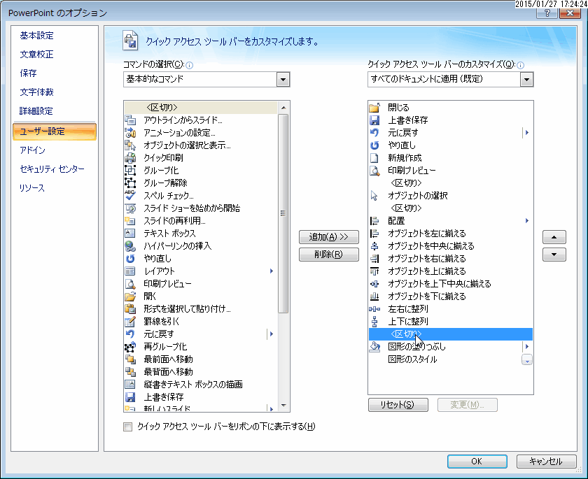

# Title: PowerPoint

date: 2014-09-16 13:52
tags: []
categories: []

---

## shortcut keys

* レベル下げ
		Shift + Alt + →
* レベル上げ
		Shift + Alt + ←

## notes

* 2010で以下のエラーが表示される。このWebサーバーへのアクセスは既定で無効になっています。このWebサーバーは基本認証で制御されており、SSL（セキュアソケットレイヤー）使用されていないことが原因です。マイクロソフトオンラインサポートで技術情報を検索しますか？
	* ファイル -> オプション -> セキュリティセンター -> セキュリティセンターの設定 -> プライバシーオプション -> 「［リサーチ］作業ウィンドウで新しいサービスの確認とインストールを許可する」チェックボックスをオフにします。
	* refs: <[【Office2010】ファイルを開くとき「このWebサーバーへのアクセスは既定で無効・・・」と表示 : 目指せるのかスローライフな生活？](http://okirakurak.exblog.jp/14291012)>

* 英文字のオートコレクトが邪魔
	* ファイル -> オプション -> 文章校正 -> オートコレクトのオプション -> 2文字目を小文字にする : unchecked

### スライド番号追加

* 表示 - プレゼンテーションの表示 - 標準
* スライド - スライド番号 - 最初のスライド選択
* 挿入 - テキスト - スライド番号

* references : <https://support.office.com/ja-jp/article/%E3%82%B9%E3%83%A9%E3%82%A4%E3%83%89%E7%95%AA%E5%8F%B7%E3%80%81%E3%83%9A%E3%83%BC%E3%82%B8%E7%95%AA%E5%8F%B7%E3%80%81%E3%81%BE%E3%81%9F%E3%81%AF%E6%97%A5%E4%BB%98%E3%81%A8%E6%99%82%E5%88%BB%E3%82%92%E8%BF%BD%E5%8A%A0%E3%81%99%E3%82%8B-21e67a79-3d55-4d97-ba7f-4f32c160ec5b?ui=ja-JP&rs=ja-JP&ad=JP>

## settings

## reference

* <http://www.relief.jp/itnote/archives/014559.php>

