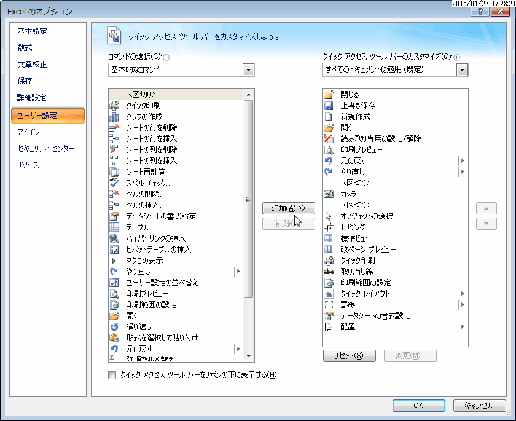

Title: excel
==========
date: 2014-09-18 14:53
tags: []
categories: []
- - -
# reference
* <http://office.microsoft.com/ja-jp/excel-help/HP010073848.aspx>

# shortcut keys
* 日付入力
: Ctrl + ;
* 時刻入力
: Ctrl + :
* 行を非表示
: Ctrl + 9
* 行を表示
: Ctrl + Shift + 9
* 列を非表示
: Ctrl + 0
* 列を表示
: Ctrl + Shift + 0
* 数式を表示
: Ctrl + Shift + @

# settings

# add-in
* エクセルパスワード解除ソフト : エクセルパスワード瞬時解除.xlam
* Relax Tools                  : オートシェイプ内文字列検索のための使用

# function
* 中央値 :
=MEDIAN
* 特異な値を除いた平均 :
=TRIMMEAN

# tips
* グラフでX軸とY軸を「グラフツール - 行/列の入れ替え」で入れ替えれる
* 表示しているセルだけ選択
: ［Alt］キー＋［;］

* 中央値
